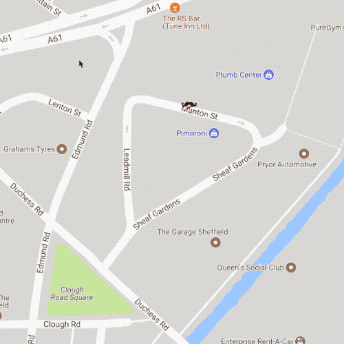

# lopy-gps-maps

_Proof of concept code for live tracking on Google Maps with GPS over LoRa._

The HTML and JavaScript handling the Google Maps live tracking is adapted from
[picklepete's live ISS tracking](https://github.com/picklepete/iss).

Be aware that the GPS sometimes takes a while to lock on and stabilise. In our
testing, the range was somewhere in the 300-500m range without line of sight, so
is likely to be much longer with line of sight and/or better antennae.

## Hardware

This example uses two Pycom LoPy boards, with antennae, one extension board, and
one Pytrack board for the GPS tracking, plus two of the cases. All of the 
hardware is available from [Pimoroni](https://shop.pimoroni.com/collections/pycom).

Check out the excellent [Pycom documentation](https://docs.pycom.io/) for 
details of how to set up your boards and how to connect them to Wi-Fi, sync 
them over FTP, etc.

## Software

### Sender

The  file should be uploaded to the LoPy sender
board mounted on the Pytrack powered by either a USB battery pack or a LiPo 
battery, and renamed as `main.py`. You'll also need to stick the 
[Pytrack lib files](https://github.com/pycom/pycom-libraries/tree/master/pytrack/lib)
into the `lib` folder on your LoPy sender.

### Receiver

The  file should be uploaded to the LoPy 
receiver board mounted on the extension board, and renamed as `main.py`. You 
won't need any additional libraries for this one.

### Website

The  should be served from another machine. I won't go
into the details of how to set up Apache, etc. YOYO!

You'll need to get a
[developer key](https://developers.google.com/maps/documentation/javascript/) 
for the Google Maps JavaScript API, but they're free. Put this into the header
where it says `YOURKEYHERE`. 

You'll also need to insert the IP address of your LoPy receiver where it says
`http://your.ip.address.here/position.json`.